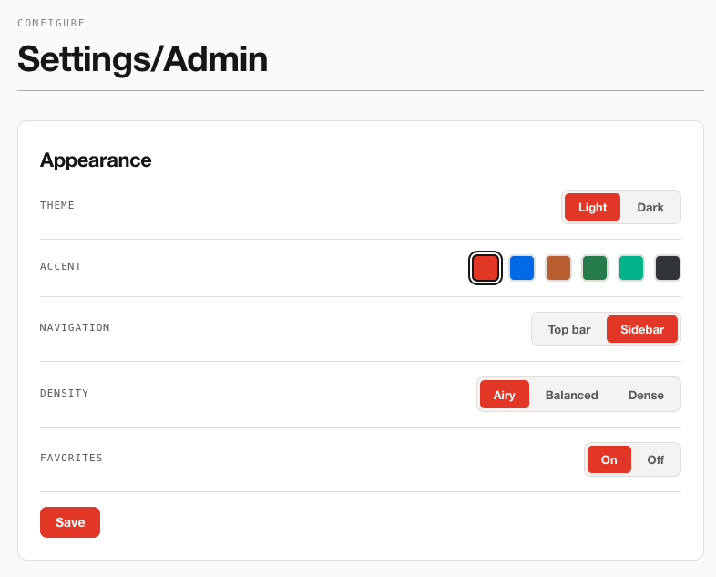
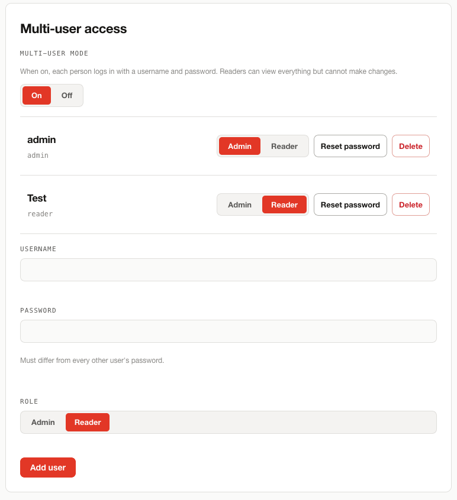
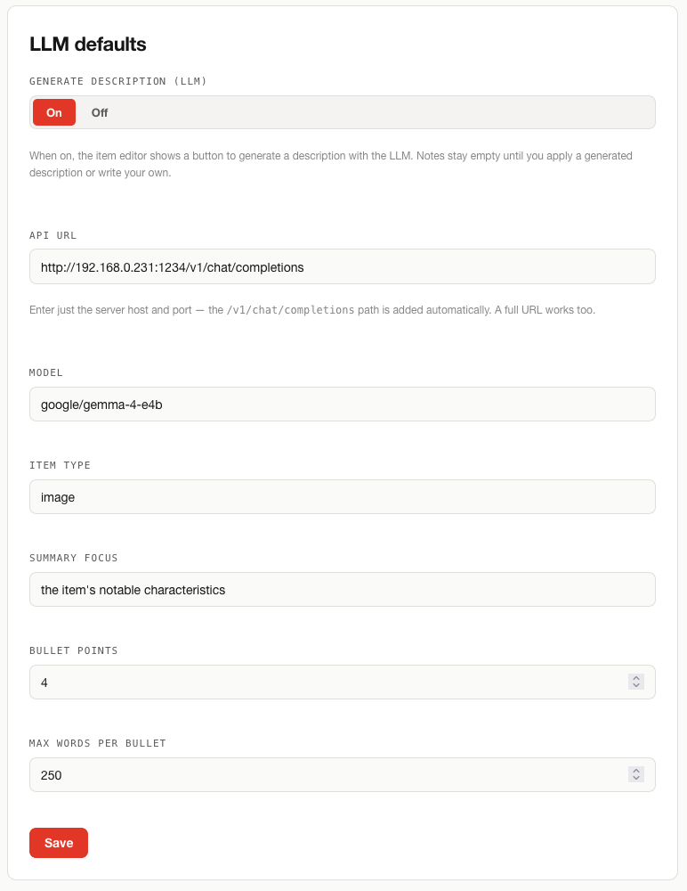
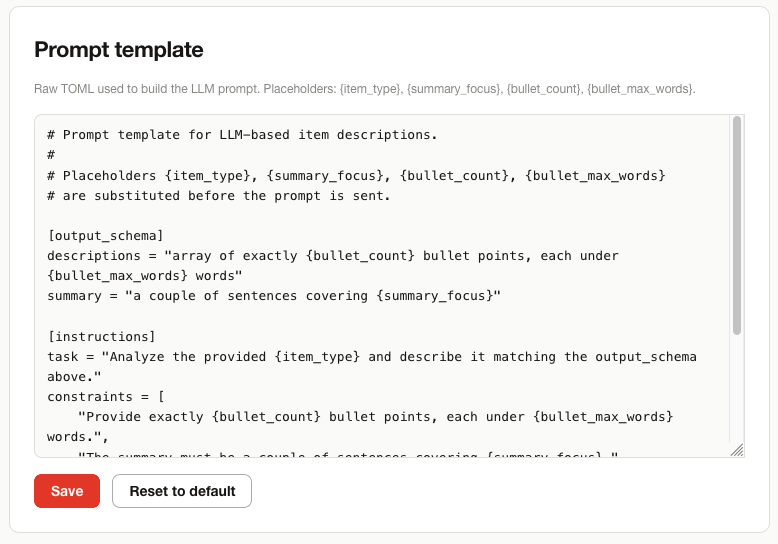
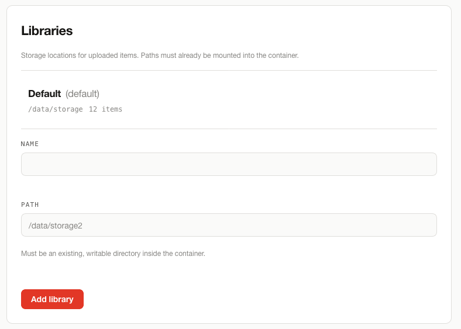
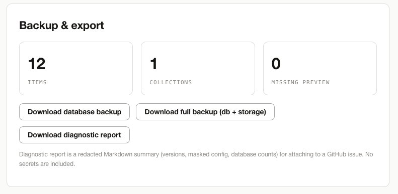

<p class="kicker">Documentation</p>

# Admin documentation

<p class="lead">Configuration, storage, AI setup, backups, and operations.</p>

For everyday use (uploading, editing, portfolios), see [User documentation](user.md). For
deployment, see [Install](install.md).

## Access model

CatalogueCanvas can run in single-admin or **multi-user** mode, secured by passwords and a
session cookie.

- **Admin** — full access: upload, edit, organise, configure, and publish. All management
  screens require an authenticated admin session.
- **Reader** _(multi-user mode)_ — can view the whole catalogue and download files, but cannot
  modify anything; all admin-only menus and controls are hidden.
- **Public visitor** — no login; can only reach portfolios marked **Public**.

When multi-user mode is **on**, users sign in with a **username and password**, and every
user's password must be **unique**. When it is **off**, the original single-password admin login
is used. The signed-in username is shown next to the **Log out** button. Admins manage accounts
from the **Users** panel in Settings.

Security notes:

- Login is **rate-limited**: 5 failed attempts from one address in 5 minutes blocks further tries.
- Passwords are hashed (argon2); sessions use a signed cookie.
- Sessions are **server-tracked and revocable**, and state-changing requests are protected
  against CSRF with a double-submit token.
- The session signing key is generated automatically on first start and persisted at
  `<CC_DATA_DIR>/secret.key` — no manual setup required.
- Set a strong `CC_ADMIN_PASSWORD` in production (and a distinct password for every account in
  multi-user mode).

## Network access

!!! danger "Public IP addresses are blocked by default"

    `CC_ALLOW_EXTERNAL_REQUESTS` defaults to `false`. Requests arriving from a public IP address
    are refused with `403`; only private, loopback and link-local clients are served. If you
    reach your instance over a public address, set this before upgrading:

    ```dotenv
    CC_ALLOW_EXTERNAL_REQUESTS=true
    ```

The default guards against the commonest self-hosting accident: a port forward that quietly puts
the whole catalogue on the internet. It applies to **every route, public portfolio links
included**, so publishing a portfolio to the world is something you opt into rather than
something a stray router rule does for you.

A blocked request returns this body:

```json
{
  "detail": "external requests are disabled. Set CC_ALLOW_EXTERNAL_REQUESTS=true to serve public clients, or add your reverse proxy to CC_TRUSTED_PROXIES."
}
```

### Behind a reverse proxy

With nginx, Caddy, Traefik or a Cloudflare Tunnel in front, every request arrives from the
proxy, so the check needs to know which address is the proxy and which is the real client. List
the proxy:

```dotenv
CC_ALLOW_EXTERNAL_REQUESTS=true
CC_TRUSTED_PROXIES=172.18.0.2
```

`X-Forwarded-For` is read **only** when the immediate peer is on that list. Trusting the header
from any caller would let anyone claim to be `127.0.0.1` and walk past the check, so while
`CC_TRUSTED_PROXIES` is empty the header has no effect at all.

Blocked requests are recorded in the [activity log](#activity-log), rate-limited to one entry
per source address per minute so a port scanner cannot fill your disc.

## Settings overview

The **Settings** page groups: Appearance, Users, Activity log, Usage statistics, LLM defaults, Prompt template, Libraries, and Backup & export.

### Appearance

Theme (light/dark), accent colour, navigation layout (top/side), density (airy/balanced/dense),
and enable/disable **Favourites**.

<figure markdown>
  
  <figcaption>Settings → Appearance</figcaption>
</figure>

### Users

Enable **multi-user mode** and manage accounts. Each user has a username, a password, and a
role (Admin or Reader). Every user's password must be unique. The **last remaining admin**
cannot be demoted or deleted. With multi-user mode off, the instance uses the single-password
admin login.

<figure markdown>
  
  <figcaption>Settings → Users (multi-user mode on, with Admin and Reader accounts)</figcaption>
</figure>

### Activity log

A table of recent entries (when, who, action, target, detail), with **Download log (CSV)** to
take the whole file away, and **Delete log** behind a typed confirmation, the same
type-this-phrase pattern the metadata backups use, so it cannot happen on a stray click.

Clearing the log writes one final entry recording the clear, *after* truncation. A wiped log
therefore shows who wiped it and when, rather than reading as an install where nothing ever
happened.

See [Activity log](#activity-log) for the file format and what is recorded.

### Usage statistics

Off by default. When switched on, the instance sends an anonymous ping at most once a week
carrying only the app version, install type, operating system, database size, item count and
total RAM. No hostname, IP, file paths or catalogue content is ever included.

The one-time install ping is separate and controlled by `CC_INSTALL_TRACKING`, not by this
toggle. [Privacy](privacy.md) lists every field, shows the exact payloads, and covers
sending the data to your own PostHog instead.

### LLM defaults

| Field | Meaning |
|---|---|
| API URL | OpenAI-compatible chat-completions endpoint |
| Model | Model name to call |
| Item type | What the items are (e.g. "image", "artwork") |
| Summary focus | What the description should emphasise |
| Bullet points | How many bullets to generate |
| Max words per bullet | Length cap per bullet |
| Generate description (LLM) | Whether the item editor offers a generate button |

<figure markdown>
  
  <figcaption>Settings → LLM defaults</figcaption>
</figure>

### Prompt template

Edit the raw **TOML** prompt used to build the LLM request. Placeholders:
`{item_type}`, `{summary_focus}`, `{bullet_count}`, `{bullet_max_words}`. Includes a
**reset-to-default** option.

<figure markdown>
  
  <figcaption>Settings → Prompt template</figcaption>
</figure>

### Libraries (multi-storage)

- Add libraries pointing at different **writable directories** (e.g. a second disc).
    - Paths must already be **mounted into the container** and writable.
- Set any library as the **default** for new uploads.
- Constraints: a library's **path can't change** once it holds items; a library **can't be deleted**
  while it contains items or while it is the default.

<figure markdown>
  
  <figcaption>Settings → Libraries</figcaption>
</figure>

### Backup & export

- **Database backup** — a single SQLite snapshot.
- **Full backup** — a ZIP of the database **plus every stored asset** across all libraries.
- Live stats shown: total items, total collections, items missing a preview.

!!! warning "Exports are unencrypted"

    Database and full-data exports are admin-only but unencrypted. Download and store them over a trusted channel.

<figure markdown>
  
  <figcaption>Settings → Backup &amp; export</figcaption>
</figure>

## Collections and portfolio visibility (multi-user mode)

In multi-user mode each collection and portfolio has a **visibility** setting. **Admin only** (the default) hides the item from reader accounts entirely — it won't appear in lists, and direct URLs return "not found". **Readers** makes it visible to reader accounts as well.

After an upgrade, all existing collections and portfolios land on admin-only. Admins need to change them to **Readers** explicitly. Public portfolios at `/p/<slug>` are unaffected by this setting.

## LLM / AI descriptions in depth

- Works with any **OpenAI-compatible vision LLM** — local (LM Studio, Ollama) or hosted.
- An **API key may be supplied per request** and is used **only for that request — never stored**.
  This also applies to **batch generation**: an optional API-key field is available when
  generating descriptions for many selected items at once.
- The API URL is **auto-completed** — enter just the host and port
  (e.g. `http://host.docker.internal:1234`) and `/v1/chat/completions` is appended; a full URL
  also works.
- **Reasoning is stripped** from results: `<think>` blocks and reasoning preambles from
  "thinking" models are removed, and the prompt requests a clean JSON-only response, so
  descriptions contain only the summary and bullet points.
- The request **timeout is configurable from Settings** (default 90 seconds), for both
  single-item and batch description generation — useful for local LLMs where a cold model load
  can exceed the default.
- Failures report the **actual cause** (connection, HTTP error, non-JSON, or no choices
  returned) rather than an opaque error.
- The `api_url` is validated **at settings-save time** — an invalid or non-allowlisted URL is rejected immediately with an error rather than failing silently at describe time.

### LLM endpoint allowlist (`CC_LLM_ALLOWED_HOSTS`)

`CC_LLM_ALLOWED_HOSTS` is optional. When set, it takes a comma-separated list of hostnames or IPs; any `api_url` whose host isn't on the list is rejected when you save settings. This stops the Describe feature from being redirected at internal services you didn't intend.

Self-hosted servers on your LAN need to be listed explicitly, e.g. `CC_LLM_ALLOWED_HOSTS=ollama.lan,192.168.1.50`. Leave it unset for no restriction — the previous behaviour.

See [Configuration](install.md#configuration) for all available environment variables.

## Findable metadata (FAIR)

- **Full-text search** covers every item's title, description/note, tags, and the full contents
  of its uploaded `metadata.json` / `metadata.toml`. Results are ranked by relevance, with prefix
  matching. Search is handled on the server.
- Each item exposes a **machine-readable metadata record** in **JSON-LD** (schema.org
  `VisualArtwork` / Dublin Core) at `/api/items/{id}/metadata`, linked from the item page. The
  record embeds the item's persistent ID as `@id` / `identifier`, maps title, description, and
  tags to standard terms, and carries the uploaded metadata as additional properties — so items
  are **findable and harvestable by external tools** (the "F" in FAIR).

## How items are stored (operator view)

- Each item lives under its library at `items/<item-id>/` with a `preview.webp` and an `other/` folder.
- **SVGs are LZ4-compressed** on disc. Compressed files are served **exactly as stored, as a
  download** — never decompressed or rendered in the browser. The WebP preview generated at
  ingestion remains the display image.
- Item IDs are unique `word-NNN` strings, checked against the database to avoid collisions.
- Items are **deduplicated by content hash** at ingest.
- Before extracting a ZIP, ingestion checks available disc space and enforces a per-file size cap as files are decompressed. An archive that would breach the limit is rejected with a clear error; normal uploads are not affected.
- **SVG previews are capped at 2500 pixels on the longest edge** (`CC_PREVIEW_MAX_EDGE`). Rasterising an SVG costs roughly the square of the output size, so without a cap a dense plotter file could take minutes and hold up an upload. The cap keeps the aspect ratio and never enlarges an image already below it. Set it to `0` to remove the limit. It applies to new ingests only; previews generated before the setting existed are unchanged.
- **Ingestion runs off the request event loop.** Uploading a large or dense ZIP no longer blocks unrelated requests. Before this, one slow ingest could stall every other call on the worker, which behind a reverse proxy appeared as a `504` on the upload and on unrelated pages while the app's own log reported success.

### Upload concurrency and memory

`CC_MAX_CONCURRENT_UPLOADS` (default `4`) caps how many uploads ingest at the same time. Each
concurrent ingest job can transiently hold up to `CC_MAX_ZIP_TOTAL_BYTES` of decompressed data in
memory, so the cap bounds a burst's peak memory to roughly `CC_MAX_CONCURRENT_UPLOADS ×
CC_MAX_ZIP_TOTAL_BYTES` — about 4 GiB at the defaults — rather than growing unchecked. Memory is
also explicitly trimmed back after every ingest completes, so resident memory drops toward
baseline once a burst finishes instead of staying at its peak until a restart.

Requests beyond the cap simply wait their turn; there's no new error path and no change to the
API response, just a longer wait if the server is already processing four uploads. On a
memory-constrained host — a small VPS or a Raspberry Pi — lowering `CC_MAX_CONCURRENT_UPLOADS`
trades upload latency under load for a lower memory ceiling. See
[Configuration](install.md#configuration).

## Diagnostics

Admins can download a **redacted Markdown diagnostic report** from Settings (or generate it via
a CLI script) to attach to a GitHub issue. It covers:

- Versions and **build provenance** (git SHA and build date).
- **Masked** configuration (no secrets).
- Disk and storage usage.
- LLM configuration plus a **live endpoint reachability probe**.
- Database counts.
- A **storage-integrity check** (missing or orphaned files).
- The effective **access policy**: whether external requests are allowed, and which proxies are
  trusted.
- **Activity-log status**: whether it is on, and where it writes.

Those last two answer the "I can't reach my instance" question immediately, since the report
shows at a glance whether the [external-request block](#network-access) is what's biting.

## Activity log

<p class="lead">Every change is recorded to a file on your own disc: who did it, when, what action, and what it touched.</p>

Before this existed nothing recorded mutations at all. The only trace was uvicorn's access log,
which gives method, path and status but never identity — so if two people shared an admin login,
"who deleted that item?" had no answer.

The log lives at `<CC_DATA_DIR>/logs/audit.log`. Tail it from the host with:

```bash
docker compose exec cataloguecanvas cat /data/logs/audit.log
```

### Format

JSONL: one JSON object per line, with the fields `at`, `actor`, `role`, `action`, `target` and
`detail`.

```json
{"at":"2026-08-03T14:22:07+00:00","actor":"admin","role":"admin","action":"item.delete","target":"lantern-042","detail":null}
```

One object per line means the file can be tailed, grepped, or shipped to a log collector without
a schema migration or a database round-trip.

### What is recorded

Logins, failed logins and throttled logins; item uploads, deletions, metadata edits and all four
batch operations; CSV imports; collection, portfolio, user and library create, update and delete;
portfolio share-token mint and clear; static exports; settings updates; and database and
full-backup downloads.

### What is never written

Passwords, password hashes, share-token values, note bodies, prompt templates, and the LLM API
URL.

Settings and item edits record **field names only**, as in `{"fields": ["llm_api_url"]}`, never
the value behind it. Failed logins record the attempted username but never the password, and
never the client IP.

### Rotation and retention

The file rolls over at `CC_AUDIT_LOG_MAX_BYTES` (default 5 MiB), keeping one previous generation
as `audit.log.1`. Only two generations are kept, so the data volume cannot grow without bound.

That does mean older history is discarded. If you need to keep it, export the CSV from Settings
on a schedule, or ship the file somewhere else.

### It never breaks a request

Every write is best-effort. A read-only volume or a full disc degrades to no logging rather than
failing the upload that triggered it — with the log directory made unwritable, a settings update
still returns `200`.

Configure it with `CC_AUDIT_LOG` (default `1`; set `0` to switch it off), `CC_AUDIT_LOG_PATH` and
`CC_AUDIT_LOG_MAX_BYTES`. See [Configuration](install.md#configuration).

## Command line tools

<p class="lead">A maintenance CLI, <code>cc</code>, ships in the image. No rebuild needed.</p>

```bash
docker compose exec cataloguecanvas cc <command>
```

On a bare-metal install the same commands run as `uv run cc ...` from `server/`.

| Command | What it does |
|---|---|
| `cc reset-password [--user NAME] [--password PW]` | Sets a password and **revokes every active session**, so a reset also invalidates a stolen cookie. Works for single-admin and multi-user installs. Prompts for the password when `--password` is omitted |
| `cc backup [--out DIR]` | Writes the database plus all library files to a zip |
| `cc restore ARCHIVE [--force]` | Restores a backup archive over the current data directory |
| `cc ingest DIR [--library ID] [--force]` | Bulk-ingests every `.zip` under a directory, deduplicating by content hash. `--force` re-ingests files already present |
| `cc diagnostics [--out FILE]` | The same redacted report Settings downloads, on stdout or to a file |

`cc backup` and the Settings export share one code path, so the two archives are identical in
structure.

`cc ingest` reads from a mounted folder. `docker-compose.yml` mounts `./import` read-only at
`/data/import` for it.

### Restoring a backup

`cc restore` has no equivalent in the interface; before it there was no restore path anywhere.
Because it overwrites live data, it takes several precautions:

- The archive is **validated before anything is extracted**. Path traversal (`../`), absolute
  paths and symlink entries are rejected, so a corrupt or malicious archive cannot write outside
  the data directory.
- It refuses to overwrite a database that already holds items unless you pass `--force`.
- The existing database is **renamed** to `catalogue.db.pre-restore-<timestamp>`, not deleted, so
  a restore you regret is recoverable.
- It prints what the archive contains and what it is about to overwrite, then asks for typed
  confirmation — unless `--force`.

## Checking for updates

An opt-in **Updates** panel in Settings lets the admin turn on **Check for updates**. It is off by default, and nothing is checked while it stays off.

With it on, the app reads the latest version tag from the CatalogueCanvas GitHub repository at most once a week and compares it against the running version. It only reads the public version list; nothing about your instance is sent anywhere. A **Check now** button forces an immediate check and ignores the weekly interval.

When a newer release exists, an **update available → vX.Y.Z** link appears in the site footer and in the Updates panel; both point at the [Updating](install.md#updating) steps. The check, the button, and the badge are visible to the admin account only. Reader accounts and public visitors never trigger a check or see the badge.

If a check fails because the instance is offline or rate-limited, the app ignores it quietly and carries on.

## Operations checklist

- [ ] Strong `CC_ADMIN_PASSWORD` set (and a distinct reader password in multi-user mode)
- [ ] Data volume sized for expected assets (it also holds the auto-generated session key)
- [ ] Library paths mounted and writable
- [ ] Regular backup routine in place
- [ ] `CC_SITE_TITLE` / `CC_SITE_AUTHOR` set for public portfolios
- [ ] `CC_ALLOW_EXTERNAL_REQUESTS` and `CC_TRUSTED_PROXIES` match how the instance is reached
- [ ] Activity-log retention decided — only two generations are kept, so export the CSV if you need history
